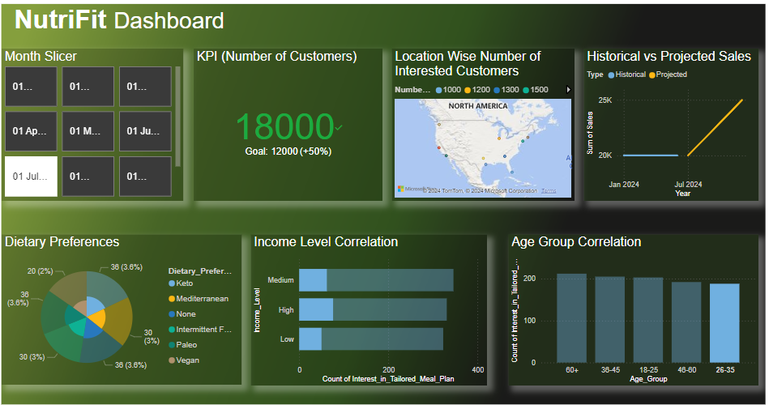

# 🥗 NutriFit: Power BI Dashboard for Nutrition & Lifestyle Analytics

## 📊 Overview
**NutriFit** is a conceptual nutrition-tech company offering personalized meal planning and wellness solutions tailored to user goals, habits, and lifestyles.  

This Power BI dashboard was developed to help **NutriFit’s analytics and strategy team** explore consumer behavior, identify target audiences, and make informed business decisions. It visualizes survey data on diet, lifestyle, and affordability to uncover trends that can guide NutriFit’s product development and market expansion strategies.  

The project demonstrates how **business intelligence and data visualization** can empower startups in the health and nutrition domain to make evidence-based, customer-centric decisions.

---

## 🌐 Live Interactive Dashboard
👉 **[View the Interactive Dashboard Here](https://app.powerbi.com/view?r=eyJrIjoiNGZlNTEyMDAtYmEzMS00N2Y0LWJlM2YtZGFmZTg3ZWExMTU3IiwidCI6ImFlYWQ3NmEyLTFhZjctNDUxMy04NmQzLTVkMDVhNmU4ZDRmNiJ9)**  
*(Click the link above to explore the Power BI dashboard interactively.)*

## 📷 Dashboard Preview

  
   <em>Figure: NutriFit Power BI Dashboard – Overview Page</em>

---

---

## 🎯 Objectives
- Analyze **customer demographics and lifestyle patterns** influencing dietary choices  
- Identify **potential customer segments** and affordability trends  
- Compare **historical vs. projected sales** to evaluate business growth  
- Support **data-driven strategy and decision-making** for NutriFit’s leadership  

---

## 💡 Key Insights
- Majority of respondents prefer **balanced meal plans** with **flexible pricing**  
- High potential market observed among **adults aged 60+**, expanding beyond youth-focused audiences  
- Lifestyle and occupation strongly influence **dietary preferences and budget allocation**  
- Insights support **service personalization, brand awareness, and retention strategies**

---

## 🧠 Technologies & Tools
| Tool | Purpose |
|------|----------|
| **Microsoft Power BI** | Dashboard design, modeling, and visualization |
| **Excel / CSV Data** | Input dataset (survey responses) |
| **DAX** | Measures, KPIs, and calculated fields |
| **Power Query** | Data cleaning and transformation |

---

## 🧾 Dashboard Features
- 📈 KPI cards showing total responses, budget averages, and interest ratios  
- 🧍‍♀️ Visuals on demographics, occupations, and gender distribution  
- 🍱 Meal preference and affordability breakdown  
- 🌙 Correlation between sleep patterns and diet goals  
- 🔮 Forecasting visuals for projected NutriFit sales performance  

---

## 🧩 Data Structure
| Field | Description |
|--------|-------------|
| `Age` | Age group of respondent |
| `Gender` | Gender of participant |
| `Occupation` | Professional or student category |
| `Sleep_Hours` | Average daily sleep duration |
| `Meal_Preference` | Type of diet followed |
| `Budget` | Willingness to spend on customized meal plans |
| `Interest_Level` | Interest in subscribing to NutriFit’s services |

---

## 🏁 Conclusion
This Power BI dashboard enables **NutriFit** to convert survey data into actionable insights for product planning and customer engagement. By integrating KPIs, forecasting, and behavior analytics, the project highlights how **data visualization can transform health and nutrition analytics** into a strategic growth tool.

---

📧 [Connect on LinkedIn](https://www.linkedin.com/in/prakharkochhar/)

---

⭐ *If you found this dashboard insightful, consider starring the repository to show your support!*
